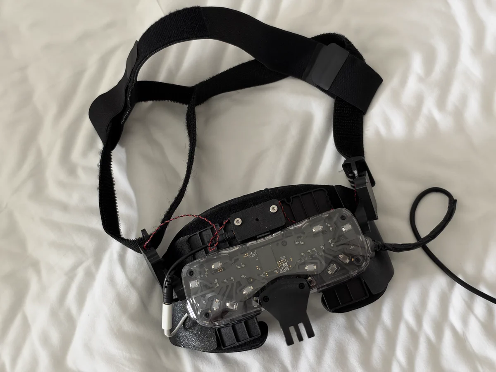
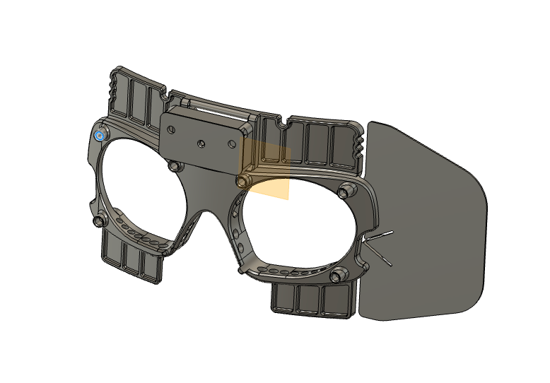

# BSB Sleep Mod

[English](README.md) | [简体中文](README.zh-CN.md) | 日本語

睡眠時の快適さを追求した BSB 用の改造パーツです。

- 顔への圧迫感を軽減
- 水洗いできるフェイスインターフェース
- 改造パーツはすべて 3D プリントでき、交換も簡単
- 優れた通気性

## 用意するもの

- AMVR 製 Quest 3 用フェイスインターフェース
- 面ファスナーテープ
- 幅 25 mm の面ファスナーストラップ
- 瞬間接着剤
- 3 mm の磁石

## プリントするパーツ

各 STL ファイルを 1 個ずつプリントしてください。左右のミラー版を同梱しています。

| パーツ | ファイル | 推奨素材 |
| --- | --- | --- |
| cushion_bracket | [cushion_bracket.stl](stl/cushion_bracket.stl) | ナイロンまたは PETG。高強度プリセットと高いインフィル密度を使用 |
| lightblocker | [lightblocker_L.stl](stl/lightblocker_L.stl) / [lightblocker_R.stl](stl/lightblocker_R.stl) | TPU |
| strap_adapter | [strap_adapter_L.stl](stl/strap_adapter_L.stl) / [strap_adapter_R.stl](stl/strap_adapter_R.stl) | TPU |
